# Working Directory Management: Nanobot Benchmark & Proposed Solution

## Problem Statement

The trajectory analysis revealed that the agent ran `init-artifact.sh mcp-demo` from **9 different directories**, creating duplicate projects in 3 locations. The root cause: **`os.getcwd()` returns unpredictable values** across MCP server restarts.

---

## Benchmark: Nanobot's Approach

### How Nanobot Handles Working Directory

```python
# From nanobot/agent/loop.py (lines 79-83)
self.tools.register(ExecTool(
    working_dir=str(self.workspace),  # ✅ Fixed at startup
    timeout=self.exec_config.timeout,
    restrict_to_workspace=self.exec_config.restrict_to_workspace,
))
```

### Key Design Principles

| Principle | Implementation |
|-----------|----------------|
| **Single Source of Truth** | `workspace` path set once at agent startup |
| **Immutable Default** | `working_dir` is stored in `ExecTool.__init__` |
| **Explicit Override** | Agent can still pass `working_dir` per-call |
| **Context Injection** | Workspace path injected into system prompt |

### Why It Works

```
context.py (line 91):
  "Your workspace is at: {workspace_path}"
  
loop.py (line 80):
  working_dir=str(self.workspace)
```

The agent **always knows** where home base is, and commands default to that location.

---

## Current MCP Implementation (The Problem)

```python
# From file_server.py (line 210)
async def execute_command(command: str, working_dir: Optional[str] = None) -> str:
    cwd = working_dir or os.getcwd()  # ❌ PROBLEM: os.getcwd() is unpredictable
```

### Why This Fails

```mermaid
sequenceDiagram
    participant Agent
    participant MCP Server 1
    participant MCP Server 2 (after crash)
    
    Agent->>MCP Server 1: execute_command(init-artifact.sh, cwd=None)
    Note over MCP Server 1: os.getcwd() = /mcp_skill_agent
    MCP Server 1-->>Agent: Created in /mcp_skill_agent/mcp-demo
    
    Note over MCP Server 1: 💥 CRASH
    
    Agent->>MCP Server 2: execute_command(init-artifact.sh, cwd=None)
    Note over MCP Server 2: os.getcwd() = /open_memo 
    MCP Server 2-->>Agent: Created in /open_memo/mcp-demo
```



The `os.getcwd()` value depends on **where the MCP server was started**, which can change after crashes/restarts.

---

## Proposed Solution

### Option A: Fixed Workspace (Nanobot-Style)

**Change:** Set a fixed `WORKSPACE_ROOT` at server startup.

```python
# In file_server.py

# Option 1: Environment variable (flexible)
WORKSPACE_ROOT = os.getenv("MCP_WORKSPACE", "/Users/kentchiu/Documents/Github/open_memo")

# Option 2: Config file
# WORKSPACE_ROOT = load_config()["workspace_root"]

@mcp.tool()
async def execute_command(command: str, working_dir: Optional[str] = None) -> str:
    """Execute a shell command. Defaults to workspace root if no dir specified."""
    cwd = working_dir or WORKSPACE_ROOT  # ✅ Predictable default
    log_tool_call("execute_command", {"command": command, "cwd": cwd})
    # ... rest of implementation
```

**Pros:**

- Simple, one-line fix
- Matches nanobot's proven approach
- Immediate stability improvement

**Cons:**

- Requires setting env variable or config
- All commands default to one location

---

### Option B: State-Aware CWD Tracking

**Change:** Track the "current project directory" in session state.

```python
# New module: cwd_tracker.py

class CWDTracker:
    """Tracks working directory across MCP server restarts."""
    
    STATE_FILE = Path.home() / ".mcp_skill_agent" / "cwd_state.json"
    
    def __init__(self):
        self._current_project: Optional[str] = None
        self._initialized_projects: dict[str, str] = {}  # name -> path
        self._load_state()
    
    def _load_state(self):
        if self.STATE_FILE.exists():
            data = json.loads(self.STATE_FILE.read_text())
            self._current_project = data.get("current_project")
            self._initialized_projects = data.get("initialized_projects", {})
    
    def _save_state(self):
        self.STATE_FILE.parent.mkdir(parents=True, exist_ok=True)
        self.STATE_FILE.write_text(json.dumps({
            "current_project": self._current_project,
            "initialized_projects": self._initialized_projects
        }))
    
    def get_cwd(self, fallback: str) -> str:
        """Get current working directory, with fallback."""
        if self._current_project:
            return self._current_project
        return fallback
    
    def set_project(self, name: str, path: str):
        """Record that a project was initialized."""
        self._initialized_projects[name] = path
        self._current_project = path
        self._save_state()
    
    def is_initialized(self, name: str) -> bool:
        """Check if project already exists."""
        return name in self._initialized_projects

# Global instance
cwd_tracker = CWDTracker()
```

**Usage in file_server.py:**

```python
from cwd_tracker import cwd_tracker

@mcp.tool()
async def execute_command(command: str, working_dir: Optional[str] = None) -> str:
    # Use tracked CWD if available
    cwd = working_dir or cwd_tracker.get_cwd(WORKSPACE_ROOT)
    
    # Track init-artifact.sh calls
    if "init-artifact.sh" in command:
        # Extract artifact name
        match = re.search(r"init-artifact\.sh\s+(\S+)", command)
        if match:
            artifact_name = match.group(1)
            artifact_path = os.path.join(cwd, artifact_name)
            cwd_tracker.set_project(artifact_name, artifact_path)
    
    # ... rest of implementation
```

**Pros:**

- Survives server restarts
- Prevents duplicate project creation
- Enables "return to last project" behavior

**Cons:**

- More complex implementation
- State file management overhead

---

### Option C: Agent-Side Rules (No Code Changes)

**Change:** Add strict rules to the agent's system prompt.

```markdown
## Working Directory Rules

CRITICAL: Before running `init-artifact.sh`:
1. Use `list_dir` to check if the target directory already exists
2. If it exists with package.json, DO NOT re-run init
3. Always specify ABSOLUTE PATHS in working_dir parameter
4. NEVER rely on default working directory

Example - CORRECT:
  execute_command(
    command="bash /path/to/init-artifact.sh mcp-demo",
    working_dir="/Users/kentchiu/Documents/Github/open_memo"  # ✅ Explicit
  )

Example - WRONG:
  execute_command(
    command="bash init-artifact.sh mcp-demo"
    # ❌ Missing working_dir - will use unpredictable os.getcwd()
  )
```

**Pros:**

- No code changes required
- Immediately deployable

**Cons:**

- Relies on agent following rules (not guaranteed)
- Doesn't fix root cause

---

## Recommendation

### Implement Both Option A + Option B

| Phase | Action | Effort |
|-------|--------|--------|
| **Immediate** | Option A: Add `WORKSPACE_ROOT` constant | 5 min |
| **Short-term** | Option B: Implement `CWDTracker` with persistence | 2 hours |
| **Optional** | Option C: Add agent prompt rules | 10 min |

### Implementation Priority

```
1. file_server.py: Add WORKSPACE_ROOT fallback
2. Create cwd_tracker.py module  
3. Integrate tracker with execute_command
4. Add state file to .gitignore
5. Update agent prompt with explicit CWD rules
```

---

## Expected Outcome

| Metric | Before | After (Option A) | After (A+B) |
|--------|--------|------------------|-------------|
| Duplicate projects | 2+ | 0 | 0 |
| CWD confusion | Frequent | Rare | None |
| Survives restart | ❌ | ✅ | ✅ |
| Tracks projects | ❌ | ❌ | ✅ |

---

## Code Diff Preview (Option A - Minimal Fix)

```diff
# file_server.py

+# Workspace root - single source of truth for default CWD
+WORKSPACE_ROOT = os.getenv(
+    "MCP_WORKSPACE", 
+    str(Path(__file__).parent.parent)  # Fallback to repo root
+)

 @mcp.tool()
 async def execute_command(command: str, working_dir: Optional[str] = None) -> str:
     """Execute a shell command and return its output. Use with caution."""
-    cwd = working_dir or os.getcwd()
+    cwd = working_dir or WORKSPACE_ROOT
     log_tool_call("execute_command", {"command": command, "cwd": cwd})
```

This single-line change would have prevented **all 3 duplicate project creations** observed in the trajectory.
