# Skills Inventory & Self-Optimization Analysis

## Current Skills Overview

| # | Skill | Category | Size | Bundled Resources | Quality |
|---|-------|----------|------|-------------------|---------|
| 1 | **mcp-builder** | Development | 237 lines | 10 files (TypeScript/Python guides, eval scripts) | ⭐⭐⭐⭐⭐ |
| 2 | **pdf** | Document Processing | 295 lines | 12 files (forms.md, reference.md) | ⭐⭐⭐⭐ |
| 3 | **pptx** | Document Creation | 484 lines | 56 files (scripts, ooxml, templates) | ⭐⭐⭐⭐⭐ |
| 4 | **skill-creator** | Meta/Tooling | 357 lines | 7 files (packaging scripts) | ⭐⭐⭐⭐⭐ |
| 5 | **slack-gif-creator** | Media Creation | 255 lines | 7 files (GIFBuilder, validators, easing) | ⭐⭐⭐⭐ |
| 6 | **test-skill** | Testing | Small | 3 files | ⭐⭐ |
| 7 | **theme-factory** | Design/Styling | 60 lines | 13 files (10 theme JSONs, showcase PDF) | ⭐⭐⭐⭐ |
| 8 | **web-artifacts-builder** | Web Development | 118 lines | 71 files (React/Vite/shadcn boilerplate) | ⭐⭐⭐⭐ |
| 9 | **webapp-testing** | Testing/QA | 96 lines | 6 files (Playwright examples, with_server.py) | ⭐⭐⭐⭐ |
| 10 | **xlsx** | Data/Spreadsheets | 289 lines | 3 files (recalc.py) | ⭐⭐⭐⭐ |

---

## Skill Categories Map

```mermaid
graph LR
    subgraph "Document Output"
        PDF["📄 pdf"]
        PPTX["📊 pptx"]
        XLSX["📈 xlsx"]
    end

    subgraph "Web & Media"
        WAB["🌐 web-artifacts-builder"]
        GIF["🎬 slack-gif-creator"]
        TF["🎨 theme-factory"]
    end

    subgraph "Development"
        MCP["🔧 mcp-builder"]
        WT["🧪 webapp-testing"]
    end

    subgraph "Meta"
        SC["🏗️ skill-creator"]
        TS["🧪 test-skill"]
    end

    SC -->|creates| MCP
    SC -->|creates| PDF
    TF -->|styles| PPTX
    TF -->|styles| WAB
    WT -->|tests| WAB
```

---

## Detailed Skill Analysis

### 1. mcp-builder ⭐⭐⭐⭐⭐

**Purpose**: Guide for building MCP (Model Context Protocol) servers for LLM-tool integration.

**Strengths**:

- Comprehensive 4-phase workflow (Design → Implement → Quality → Evaluate)
- Includes TypeScript and Python reference guides
- Built-in evaluation framework with QA pair generation
- Excellent context management guidance

**Weaknesses**:

- Very token-heavy (237 lines of SKILL.md + references)
- No auto-scaffolding script (unlike web-artifacts-builder)

> [!TIP]
> **Optimization**: Add an `init-mcp-server.sh` script that scaffolds a TypeScript or Python MCP server project, similar to `web-artifacts-builder`'s `init-artifact.sh`.

---

### 2. pdf ⭐⭐⭐⭐

**Purpose**: Read, create, merge, split, and manipulate PDFs.

**Strengths**:

- Covers pypdf, pdfplumber, reportlab, and CLI tools
- Quick reference table for choosing the right tool
- Includes OCR, watermarking, and password protection

**Weaknesses**:

- No helper scripts — all code is inline examples
- Missing modern PDF/A compliance guidance
- No integration with theme-factory for styled PDF generation

> [!TIP]
> **Optimization**: Add a `scripts/pdf_utils.py` with common functions (merge, split, text extract) so tasks can be completed via script execution instead of generating code every time.

---

### 3. pptx ⭐⭐⭐⭐⭐

**Purpose**: Create and edit professional PowerPoint presentations.

**Strengths**:

- Richest skill by far (56 files, 484-line SKILL.md)
- Full OOXML workflow: unpack → edit XML → validate → pack
- Scripts for rearranging, inventorying, and thumbnailing slides
- 16 curated color palettes with design principles

**Weaknesses**:

- Very heavy context footprint when loaded
- Requires understanding OOXML internals for advanced edits

> [!TIP]
> **Optimization**: The SKILL.md could benefit from progressive disclosure — move the 16 color palettes and OOXML details to `references/` and load only when needed.

---

### 4. skill-creator ⭐⭐⭐⭐⭐

**Purpose**: Meta-skill for creating new skills with proper structure and packaging.

**Strengths**:

- Clear architecture (SKILL.md + scripts/ + references/ + assets/)
- Progressive disclosure patterns (simple → complex)
- Packaging and validation scripts
- Excellent guiding principles ("context window is a public good")

**Weaknesses**:

- Could include more real-world skill templates as starting points

> [!TIP]
> **Optimization**: Add a `templates/` directory with 2-3 minimal skill templates (script-heavy, reference-heavy, hybrid) to speed up bootstrapping.

---

### 5. slack-gif-creator ⭐⭐⭐⭐

**Purpose**: Create animated GIFs optimized for Slack emoji and messages.

**Strengths**:

- Clear Slack requirements (128×128 emoji, 480×480 messages)
- GIFBuilder utility with optimization
- Rich animation concepts (bounce, spin, pulse, explode)
- Easing functions for smooth motion

**Weaknesses**:

- PIL-only — no support for SVG-to-GIF or video-to-GIF
- No gallery of example outputs for reference

> [!TIP]
> **Optimization**: Add `references/gallery.md` with embedded sample GIFs showing each animation type, so the agent can match user requests to proven techniques.

---

### 6. test-skill ⭐⭐

**Purpose**: Validates Level 3 agentskill protocol support.

**Strengths**:

- Serves as a protocol conformance test

**Weaknesses**:

- Minimal — only 3 files
- Not a user-facing skill

> [!IMPORTANT]
> **Optimization**: Either expand into a proper testing framework skill or consider merging with the `skill-creator` skill as a validation sub-module.

---

### 7. theme-factory ⭐⭐⭐⭐

**Purpose**: Apply consistent professional themes (colors + fonts) to any artifact.

**Strengths**:

- 10 curated themes with showcase PDF
- Works across multiple artifact types (PPTX, HTML, docs)
- Supports custom theme generation

**Weaknesses**:

- No programmatic API — relies entirely on manual color application
- The showcase PDF is view-only, no automated theme extraction

> [!TIP]
> **Optimization**: Add a `scripts/apply_theme.py` that reads a theme JSON and patches CSS variables or PPTX color attributes automatically.

---

### 8. web-artifacts-builder ⭐⭐⭐⭐

**Purpose**: Build multi-component React artifacts that bundle into single HTML files.

**Strengths**:

- Full stack: React 18 + TypeScript + Vite + Tailwind + 40+ shadcn/ui components
- init-artifact.sh scaffolds the entire project
- bundle-artifact.sh creates self-contained HTML
- Anti-"AI slop" design guidance

**Weaknesses**:

- Heavy dependency footprint (71 files in the boilerplate)
- Coupled to specific versions (tailwind 3.4.1, specific Parcel)

> [!TIP]
> **Optimization**: Version-pin dependencies in `package.json` and add a `scripts/update-deps.sh` to keep the boilerplate current. Also add a `references/component-gallery.md` showing shadcn/ui component examples for quick reference.

---

### 9. webapp-testing ⭐⭐⭐⭐

**Purpose**: Test web apps using Playwright with server lifecycle management.

**Strengths**:

- Decision tree for choosing the right approach
- `with_server.py` handles server startup/shutdown
- Multiple example scripts (element discovery, console logging)
- Clear best practices and common pitfalls

**Weaknesses**:

- No visual regression testing support
- No test report generation

> [!TIP]
> **Optimization**: Add a `scripts/visual_diff.py` that captures screenshots before/after code changes and produces a diff image, enabling visual regression testing.

---

### 10. xlsx ⭐⭐⭐⭐

**Purpose**: Create, read, and manipulate Excel spreadsheets with formulas.

**Strengths**:

- Strong emphasis on using formulas vs hardcoded values
- Recalculation script (`recalc.py`) for formula validation
- Financial modeling conventions (color coding, number formatting)
- Error checking guidance

**Weaknesses**:

- Pandas integration is mentioned but light
- No chart/visualization examples
- No template files for common spreadsheet types

> [!TIP]
> **Optimization**: Add `assets/templates/` with common spreadsheet templates (financial model, data dashboard, project tracker) and a `references/charts.md` with chart creation examples.

---

## Self-Optimization Roadmap

### Priority 1: Cross-Skill Synergies (High Impact)

| Integration | Benefit |
|-------------|---------|
| theme-factory + pptx | Auto-apply themes to generated decks |
| theme-factory + web-artifacts-builder | CSS variable injection from theme JSON |
| webapp-testing + web-artifacts-builder | Auto-test bundled artifacts before delivery |
| pdf + xlsx | Export spreadsheet data as styled PDF reports |

### Priority 2: Missing Skill Gaps

### Priority 3: Structural Improvements

1. **Reduce Context Bloat**: Skills like `pptx` (484 lines) and `skill-creator` (357 lines) should move detailed reference material to `references/` and use progressive disclosure
2. **Add Scaffolding Scripts**: Skills currently lacking init scripts (`mcp-builder`, `pdf`, `xlsx`) should add them to reduce repetitive code generation
3. **Standardize Error Handling**: All skills with scripts should follow a consistent error reporting JSON format (like `xlsx`'s recalc.py does)
4. **Add Self-Tests**: Every skill should include a `scripts/self_test.sh` that validates the skill's tools work correctly in the current environment

---

## Summary Statistics

| Metric | Value |
|--------|-------|
| Total Skills | 10 |
| Total SKILL.md Lines | ~2,486 |
| Total Bundled Files | ~198 |
| Average Quality | ⭐⭐⭐⭐ (4.0/5) |
| Skills with Scripts | 7/10 |
| Skills with Templates | 3/10 |
| Cross-Skill Integrations | 0 (opportunity!) |
