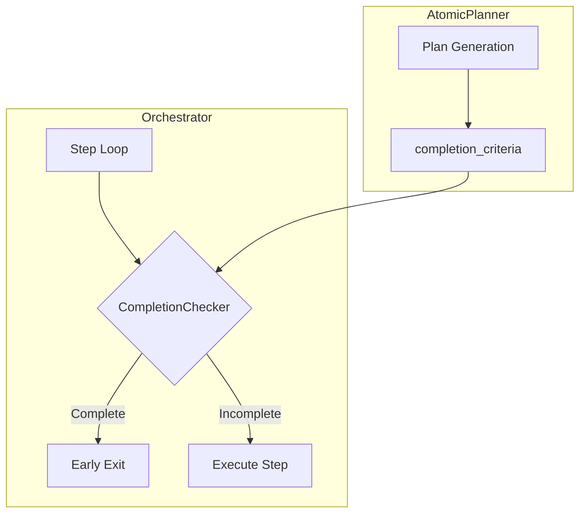

# P1: Task Completion Guard - Implementation Plan

> General-purpose early exit mechanism for the orchestrator loop

---

## Goal

Detect when a task is **already complete** (or becomes complete) and exit gracefully, preventing:

- Unnecessary step re-execution
- MCP server restarts for redundant workers
- Resource waste on completed work

---

## Design Principles

| Principle | Description |
|-----------|-------------|
| **General** | Works for ANY skill, not hardcoded to specific files |
| **Declarative** | Completion defined in plan, not orchestrator logic |
| **Multi-Signal** | Supports file-based, command-based, and LLM-based completion |
| **Early Exit** | Checks BEFORE each step, not just at end |

---

## Architecture



---

## Proposed Changes

### 1. [NEW] `completion_checker.py`

**Path**: `orchestrator/completion_checker.py`

```python
@dataclass
class CompletionCriteria:
    """Declarative completion conditions."""
    required_artifacts: List[str] = field(default_factory=list)
    success_signals: List[str] = field(default_factory=list)
    command_checks: List[str] = field(default_factory=list)

class CompletionChecker:
    """General-purpose task completion detector."""
    
    def __init__(self, memory_manager, workspace_root: str):
        self.memory = memory_manager
        self.workspace = workspace_root
    
    def is_complete(self, criteria: CompletionCriteria) -> Tuple[bool, str]:
        """Returns (is_complete, reason)"""
        ...
```

---

### 2. [MODIFY] `structs.py` - Add completion_criteria to plan

```diff
@dataclass
class AtomicPlannerOutput:
    steps: List[SkillStep]
    reasoning: str = ""
+   completion_criteria: CompletionCriteria = None
```

---

### 3. [MODIFY] `orchestrator.py` - Integrate guard

```diff
+ from .completion_checker import CompletionChecker, CompletionCriteria

  async def run(self, query: str):
      ...
+     checker = CompletionChecker(self.memory_manager, WORKSPACE_ROOT)
+     
+     # Derive criteria from plan's final step
+     criteria = self._derive_completion_criteria(plan_output)
      
      while step_idx < len(steps):
+         # EARLY EXIT: Check if already complete
+         is_done, reason = checker.is_complete(criteria)
+         if is_done:
+             logger.info(f"Task already complete: {reason}")
+             break
          
          current_step = steps[step_idx]
          ...
```

---

## CompletionChecker Logic

### Multi-Signal Detection

```python
def is_complete(self, criteria: CompletionCriteria) -> Tuple[bool, str]:
    # 1. Check required artifacts exist
    for artifact in criteria.required_artifacts:
        path = self._resolve_path(artifact)
        if os.path.exists(path):
            return True, f"Artifact exists: {artifact}"
    
    # 2. Check success signals in memory
    for signal in criteria.success_signals:
        if self.memory.has_signal(signal):
            return True, f"Signal found: {signal}"
    
    # 3. Run command checks (e.g., "ls bundle.html")
    for cmd in criteria.command_checks:
        if self._run_check(cmd):
            return True, f"Check passed: {cmd}"
    
    return False, "Not complete"
```

### Auto-Derive from Plan

```python
def _derive_completion_criteria(self, plan: AtomicPlannerOutput) -> CompletionCriteria:
    """Infer completion from final step's expected_artifacts."""
    if not plan.steps:
        return CompletionCriteria()
    
    final_step = plan.steps[-1]
    return CompletionCriteria(
        required_artifacts=final_step.expected_artifacts,
        success_signals=["MISSION_COMPLETE", "TASK_DONE"]
    )
```

---

## Example: Web Artifact Skill

For a task "Create MCP demo app", the derived criteria:

```yaml
completion_criteria:
  required_artifacts:
    - "mcp-demo/bundle.html"
    - "mcp-demo/dist/index.html"
  success_signals:
    - "BUNDLE_SUCCESS"
  command_checks:
    - "test -f mcp-demo/bundle.html"
```

---

## Files to Modify

| File | Change |
|------|--------|
| [NEW] `orchestrator/completion_checker.py` | CompletionChecker class |
| [MODIFY] `orchestrator/structs.py` | Add `CompletionCriteria` dataclass |
| [MODIFY] `orchestrator/orchestrator.py` | Integrate checker in loop |
| [MODIFY] `orchestrator/atomic_planner.py` | Set criteria in plan output |

---

## Verification Plan

### Test Cases

1. **Already Complete**: Run orchestrator when `bundle.html` exists → should exit immediately
2. **Mid-Execution Complete**: Step 2 creates final artifact → should skip steps 3+
3. **Not Complete**: No artifacts → should execute all steps
4. **Custom Criteria**: Skill-defined completion → should respect

### Commands

```bash
# Test 1: Pre-existing artifact
touch mcp-demo/bundle.html
python orchestrator.py "Build MCP demo"
# Expected: "Task already complete: Artifact exists"

# Test 2: Clean run
rm -rf mcp-demo
python orchestrator.py "Build MCP demo"
# Expected: Executes all steps
```

---

## Next Steps

1. [ ] Create `completion_checker.py` with `CompletionChecker` class
2. [ ] Add `CompletionCriteria` to `structs.py`
3. [ ] Integrate guard in `orchestrator.py` loop
4. [ ] Enhance `AtomicPlanner` to populate criteria
5. [ ] Test with web-artifacts-builder skill
