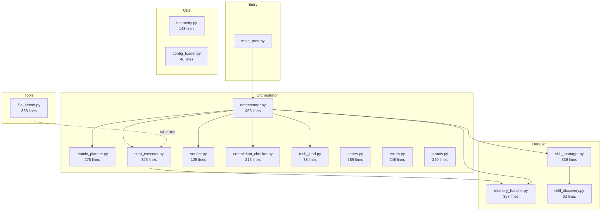
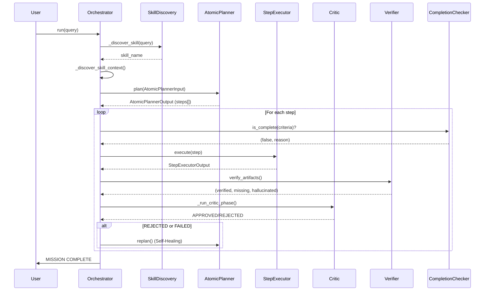

# Deep Analysis: `mcp_skill_agent` as a Personal Agent Foundation

## Executive Summary

After reading all **~3,600 lines across 18 Python files**, this project is an **ambitious multi-agent orchestrator** built on the `mcp-agent` library with Ollama. It demonstrates strong architectural vision with a well-defined pipeline (Discovery → Planning → Execution → Verification → Critic). However, it has **significant structural and maturity issues** that make it **not yet suitable as a foundation** for a personal agent without substantial rework.

**Verdict: 🟡 Promising Prototype, Not Production Foundation**

---

## Architecture Overview



## Execution Pipeline



---

## Strengths ✅

### 1. Well-Designed Multi-Agent Pipeline
The orchestrator implements a sophisticated pipeline with separation of concerns:
- **Planner** → breaks tasks into atomic steps
- **Executor** → runs steps via ephemeral worker agents  
- **Verifier** → checks for artifact existence on disk
- **Critic** → LLM-based quality audit
- **Tech Lead** → debugging advisor (not integrated yet)
- **Completion Guard** → early exit detection

### 2. Progressive Disclosure for Skills (3-Level Architecture)
The skill system is elegant and token-efficient:
- **L1 (Awareness)**: Skill names/descriptions in system prompt — near-zero tokens
- **L2 (Activation)**: Full `SKILL.md` loaded on demand
- **L3 (Execution)**: Scripts/references loaded only when needed

### 3. Well-Defined DTOs and Contracts
The [structs.py](file:///Users/kentchiu/Documents/Github/open_memo/mcp_skill_agent/orchestrator/structs.py) defines clear data contracts:
- `SkillStep`, `StepExecutorInput/Output`, `CriticInput/Output`, `AtomicPlannerInput/Output`
- These enable clean handoffs between components

### 4. Self-Healing with Replanning
When a step fails, the orchestrator asks the `AtomicPlanner` to generate a recovery plan and injects new steps — a sophisticated resilience pattern.

### 5. Telemetry & Error Taxonomy
- `structlog`-based structured logging with session tracking
- Rich error taxonomy with `ErrorCategory`, `ErrorSeverity`, and `recoverable` flags
- State machine with transition validation

### 6. Security Considerations
- Command safety guard with deny patterns in `file_server.py`
- Path traversal prevention in skill references
- Workspace sandboxing in `SessionMemory`

---

## Critical Issues 🔴

### 1. State Machine is Defined but NOT Used
The well-designed `StateManager` in [states.py](file:///Users/kentchiu/Documents/Github/open_memo/mcp_skill_agent/orchestrator/states.py) is **never instantiated or referenced** in [orchestrator.py](file:///Users/kentchiu/Documents/Github/open_memo/mcp_skill_agent/orchestrator/orchestrator.py). State transitions are implicit in the control flow. This means:
- No transition validation at runtime
- No state history for debugging
- The carefully designed state machine is dead code

### 2. Error Taxonomy is Defined but NOT Used  
All the specific error classes in [errors.py](file:///Users/kentchiu/Documents/Github/open_memo/mcp_skill_agent/orchestrator/errors.py) (`SkillNotFoundError`, `StepExecutionError`, `ArtifactError`, etc.) are **never raised** anywhere. The orchestrator uses a bare `except Exception as e` at the top level. The `classify_error()` utility is never called.

### 3. Duplicate Field Declarations in Dataclasses
```python
# In structs.py, StepExecutorInput (line 33-34):
session_context: str   # Defined TWICE
session_context: str   

# In SessionMemory (line 210-211):
current_step_id: int = 0  # Defined TWICE
current_step_id: int = 0
```
These are bugs that Python silently ignores (second overwrites first).

### 4. Heavy LLM Dependence for Simple Tasks
The orchestrator makes **at minimum 4 LLM calls** for any task:
1. Skill discovery (LLM selects which skill)
2. Atomic planning (LLM decomposes steps)
3. Step execution (LLM executes work)
4. Critic review (LLM audits output)

For a personal agent running on local models (Ollama), this is **extremely expensive**. A simple file creation task goes through the entire pipeline.

### 5. CLI Module Has Broken Imports and Stub Implementation
[commands.py](file:///Users/kentchiu/Documents/Github/open_memo/mcp_skill_agent/cli/commands.py) references:
- `from mcp_skill_agent.config_loader import load_config` — but `config_loader.py` exports `ConfigManager`, not `load_config`
- `from mcp_skill_agent.file_server import mcp` — wrong module path (should be `tools.file_server`)
- `from mcp_skill_agent.skill_discovery import discover_skills` — `discover_skills` doesn't exist
- Most commands are `TODO: Not yet implemented`

### 6. No Conversation Memory / Multi-Turn Support
`SessionMemory` is **per-execution only** (in-memory `dataclass`). There is:
- No persistence between runs  
- No conversation history
- No user preference learning
- No long-term memory

For a personal agent, this is a fundamental gap.

### 7. Fragile JSON Parsing Throughout
Nearly every module has the same fragile JSON extraction pattern:
```python
json_match = re.search(r"```json\s*(\{.*?\})\s*```", response, re.DOTALL)
if not json_match:
    json_match = re.search(r"(\{.*\})", response, re.DOTALL)
```
This pattern is duplicated in 5+ places (orchestrator, step_executor, atomic_planner, tech_lead, verifier) and is error-prone with greedy matching on `\{.*\}`.

---

## Moderate Issues 🟡

### 8. Single MCP Server Configuration
`config.yaml` only defines `file-tools`. The README mentions a `skill-server` but it's not configured. The skill system works in-process via `SkillManager` rather than through MCP, making the "MCP Skill Agent" name somewhat misleading for the skill interaction pattern.

### 9. Hardcoded to OpenAI-Compatible API
Every LLM call uses `OpenAIAugmentedLLM`:
```python
llm = await agent.attach_llm(OpenAIAugmentedLLM)
```
While this works with Ollama's OpenAI-compatible endpoint, it prevents using:
- Anthropic Claude
- Google Gemini native API
- Other non-OpenAI APIs

### 10. `TechLead` is Defined but Never Called
[tech_lead.py](file:///Users/kentchilu/Documents/Github/open_memo/mcp_skill_agent/orchestrator/tech_lead.py) implements a debugging advisor, but **it's never invoked** from the orchestrator or step executor. Another dead code module.

### 11. Workspace Root Handling is Inconsistent
- `file_server.py` loads workspace from its own `config.yaml` search (wrong path — looks in `tools/` dir)
- `orchestrator.py` uses `config.get("workspace.root")` 
- `SessionMemoryManager` takes `os.getcwd()` as workspace root
- Three different sources of truth for the same concept

### 12. No Test Coverage
Only one test file exists: [test_context_optimization.py](file:///Users/kentchiu/Documents/Github/open_memo/mcp_skill_agent/tests/test_context_optimization.py) — the project has virtually no test safety net for its complex orchestration logic.

---

## Missing Capabilities for Personal Agent

| Feature | Status | Priority |
|---------|--------|----------|
| **Conversation history** | ❌ Missing | P0 |
| **Multi-turn dialogue** | ❌ Missing | P0 |
| **User preference memory** | ❌ Missing | P0 |
| **Streaming responses** | ❌ Missing | P1 |
| **Interactive mode** | ❌ Stub only | P1 |
| **Authentication/users** | ❌ Missing | P1 |
| **Async task queue** | ❌ Missing | P1 |
| **Plugin/extension system** | 🟡 Skills (partial) | P2 |
| **Web UI / chat interface** | ❌ Missing | P2 |
| **Cost/token tracking** | ❌ Missing | P2 |
| **Model switching per task** | ❌ Hardcoded | P2 |
| **Rate limiting** | ❌ Missing | P3 |

---

## Overall Assessment

### What Works Well
- The **progressive disclosure skill pattern** is genuinely good and reusable
- The **multi-agent pipeline concept** (plan → execute → verify → critique) is architecturally sound
- The **DTO/contract pattern** with dataclasses is clean
- The **error taxonomy design** (though unused) shows mature thinking

### What Doesn't Work
- Too much **dead code** (states.py, errors.py, tech_lead.py — ~525 lines of unused code)
- **Over-engineered for its actual capability** — complex pipeline but can only do skill-guided file generation
- **Hardcoded to a single use case** (skill-based artifact creation) — not general-purpose
- **No persistence, no conversation, no memory** — fundamental for a personal agent
- **Expensive per-query** (4+ LLM calls minimum) — impractical for local models

### Recommendation

> **Use it as learning material and selectively extract patterns, but do NOT use it as-is for a foundation.**

If building a personal agent from this, you would want to:

1. **Keep**: Progressive disclosure skill system, DTO pattern, telemetry design
2. **Rework**: Make the orchestrator lightweight and configurable (skip critic for simple tasks)
3. **Add**: Persistent conversation memory, multi-turn dialogue, streaming
4. **Fix**: Wire up the state machine and error taxonomy (or remove them)
5. **Remove**: Dead code modules, duplicate field declarations
6. **Replace**: Build on a more mature agent framework (LangGraph, CrewAI) or a simpler custom loop

A better foundation strategy would be to extract the **skill system** (skill_discovery + skill_manager) as a standalone module and build a simpler agent loop around it, rather than inheriting the full orchestrator complexity.

---

## Code Quality Score Card

| Dimension | Score | Notes |
|-----------|-------|-------|
| **Architecture vision** | 8/10 | Multi-agent pipeline is well-conceived |
| **Code quality** | 4/10 | Duplicate fields, broken imports, dead code |
| **Test coverage** | 1/10 | Virtually none |
| **Production readiness** | 2/10 | Many stubs, no error handling wired up |
| **Extensibility** | 5/10 | Good DTOs, but hardcoded LLM provider |
| **Documentation** | 6/10 | Good README, decent docstrings |
| **Personal agent fitness** | 3/10 | No memory, no conversation, single-use-case |
| **Overall** | **4/10** | Promising prototype, not a foundation |
