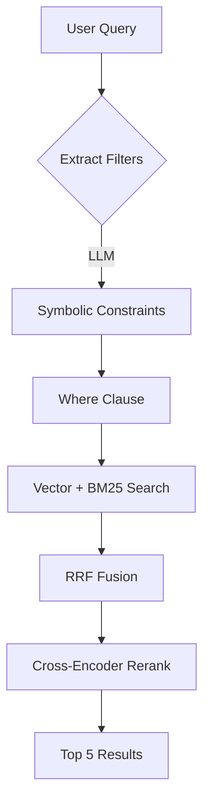

# Blog Quality Analysis & Improvement Guide
**Published**: 2026-03-01  
**Author**: Kent Chiu (Jin-Chun Chiu)  
**Topics**: Blog Quality, Content Strategy, Agentic Memory Architecture

---

## 📊 Overview

This blog post provides a comprehensive analysis of my recent blog content, offering actionable recommendations for improvement across technical depth, visual storytelling, and content strategy.

## Current Blog Portfolio

I currently have **27 blog posts** covering:
- **AI/ML Architecture** (D-RAG, Agentic Memory, Agent Loops)
- **Language Comparisons** (Python vs Rust)
- **System Design** (Evaluation frameworks, Autonomous DDL)
- **Personal Reflections** (ADHD skills training, Daily summaries)

## Key Strengths

### 1. Deep Technical Rigor
My posts demonstrate production-grade implementation with actual code examples. The D-RAG and LanceDB posts show real-world applicability.

### 2. Mathematical Foundation
Strong use of equations to formalize concepts:
```math
\text{Recall@K} = \frac{|R \cap G|}{|G|}
```
Where R represents relevant documents and G represents ground truth.

### 3. Practical Code Examples
Not just theory - includes working implementations with LanceDB, autonomous DDL managers, and hybrid retrieval pipelines.

### 4. Clear Structure
Good use of headers, tables, and code blocks for readability.

## 🔧 Recommended Improvements

### 1. Increase Visual Storytelling

**Problem**: Many posts reference components like `<DRagFlowChart />` that may not exist.

**Solution**: Add Mermaid diagrams inline for better visual communication.

**Example improvement for D-RAG architecture:**


### 2. Add "When to Use This" Decision Matrix

For architecture posts, consider adding a decision matrix:

| Use Case | Recommended Approach | Why |
|----------|---------------------|-----|
| Financial compliance | D-RAG | Deterministic isolation is critical |
| Creative brainstorming | LightRAG | Semantic relationships matter |
| Mixed workload | Hybrid | Use D-RAG with community summaries |

### 3. Enhance Code Examples

Current code snippets are excellent but could benefit from:
- **Error handling** examples (e.g., what happens when LLM extraction fails?)
- **Performance benchmarks** (e.g., "D-RAG query time: 45ms vs LightRAG: 230ms")
- **Type hints** for better developer experience

**Example improvement:**
```python
from typing import Optional, List, Dict
from pydantic import BaseModel

class MemoryQuery(BaseModel):
    query: str
    filter_conditions: List[str] = []
    top_k: int = 5
    
def query_memory(
    memory_system: "MemorySystem",
    query: MemoryQuery
) -> Optional[List[str]]:
    """Query memory system with fallback handling."""
    try:
        results = memory_system.search(
            query=query.query,
            filters=query.filter_conditions,
            top_k=query.top_k
        )
        return [result.text for result in results]
    except MemorySystemError as e:
        logger.warning(f"Memory query failed: {e}")
        return fallback_search(query.query)
```

### 4. Cross-Link Related Posts

Create a **navigation structure** or table of contents at the top of longer posts:

```markdown
## Related Posts
- [D-RAG vs LightRAG](./2026-02-26-d-rag-vs-lightrag-autonomous-ddl.mdx)
- [Autonomous DDL Implementation](./2026-02-27-implementing-drag-autonomous-ddl.mdx)
- [LanceDB Memory System](./2026-02-27-nanobot-lancedb-memory.mdx)
```

### 5. Add "Key Takeaways" Box

For technical posts, consider a summary box at the end:

> **Key Takeaways**
> - D-RAG achieves O(1) isolation through symbolic schema enforcement
> - Autonomous DDL dynamically promotes dimensions based on information gain
> - Contamination repair costs O(1) with D-RAG vs O(E + S) with LightRAG

### 6. Add "What's Next" Section

For forward-looking posts, end with:

```markdown
## Next Steps
1. Implement the Autonomous DDL manager in production
2. Benchmark against LightRAG on our actual dataset
3. Evaluate cross-encoder latency impact on real-time queries
```

## 📈 Content Strategy Recommendations

### 1. Series Structure
Organize into thematic series:
- **"Building Nanobot"**: Architecture, memory, evaluation
- **"RAG Deep Dives"**: D-RAG, comparison studies
- **"Language Philosophy"**: Python vs Rust, etc.

### 2. Audience Targeting
Your posts are very technical (great for experts). Consider adding:
- A **"TL;DR"** at the top for busy readers
- **Glossary** links for terms like BM25, Cross-Encoder, mmap

### 3. SEO Optimization
- Add **meta descriptions** and consider consistent URL structure
- **Internal linking** between related posts
- **Tags** that cross-reference (e.g., #LanceDB appears in multiple posts)

## 🎯 Memory-Related Posts Analysis

### Your Memory-Related Blog Posts

#### 1. **Advanced Agentic Memory System (2026-02-24)** ⭐ Best Post
**Topic**: Deep dive into RAG architecture with LanceDB Pro
- **Key Concepts**: BM25, RRF Fusion, Cross-Encoder Reranking, Multi-Scope Isolation
- **Strengths**: Excellent mathematical depth, clear architecture diagrams, comprehensive feature comparison table
- **Status**: Production-ready content

#### 2. **Nanobot LanceDB Memory (2026-02-26)**
**Topic**: Practical migration from text files to hybrid retrieval
- **Key Concepts**: Context poisoning, structured schema, implicit vs explicit RAG
- **Strengths**: Clear before/after comparison, practical usage scenarios
- **Status**: Well-implemented

#### 3. **Autonomous Coding Agent (2026-01-25)**
**Topic**: Memory management in long-horizon agents
- **Key Concepts**: Context compression, supervisor/worker pattern, event hooks
- **Strengths**: Detailed implementation guide, good code examples
- **Related**: MCP Skill Agent, Completion Guard

### Key Agentic Memory Concepts Covered

| Concept | Coverage | Maturity |
|---------|----------|----------|
| Hybrid Retrieval | BM25 + Vector + RRF | ✅ Production-ready |
| Cross-Encoder Reranking | Two-stage pipeline | ✅ Detailed |
| MMR Diversity | Context optimization | ✅ Well-explained |
| Multi-Scope Isolation | Memory segmentation | ✅ Enterprise-grade |
| Recency Boost | Time decay | ✅ Covered |
| Context Compression | Supervisor pattern | ✅ Good examples |

## 💡 Missing Pieces to Add

### 1. Memory Lifecycle Section
Your posts cover retrieval but not the full lifecycle. Consider adding:
- **Memory Ingestion**: How data flows from agent actions → embedding → storage
- **Memory Consolidation**: When to merge fragmented memories
- **Memory Decay**: When to purge old memories (based on recency or relevance threshold)

### 2. Memory Evaluation Framework
You mention MRR (Mean Reciprocal Rank) but don't show how to measure memory quality:

```markdown
## How to Evaluate Your Memory System

| Metric | What It Measures | Your Implementation |
|--------|------------------|---------------------|
| **Recall@K** | % of relevant docs in top K | Top 5 from MMR |
| **MRR** | Average inverse rank of first hit | Cross-encoder rerank |
| **Latency** | Query time p95 | < 100ms (LanceDB) |
| **Coverage** | % of queries hitting DB | Track via analytics |
```

### 3. Memory Self-Correction
How does the agent know its memory is wrong?
- **Memory Conflict Detection**: When new info contradicts old info
- **Confidence Scoring**: Flag uncertain memories for human review
- **Retrieval Failure Handling**: What happens when no relevant memory is found?

### 4. Cross-Linking Opportunities
Create a **Memory Architecture** hub post:

```markdown
# Agentic Memory System Hub

## Core Concepts
- [Hybrid Search (BM25 + Vector)](./2026-02-24-advanced-agentic-memory-system.mdx)
- [Nanobot Implementation](./2026-02-26-nanobot-lancedb-memory.mdx)
- [Memory Evaluation Framework](./NEW_POST)

## Related Architecture
- [Agent Loops & Context Management](./2026-02-07-agentic-loop-issues.mdx)
- [Evaluation Benchmarks](./2026-02-26-agent-evaluation-benchmarks-analysis.md)
- [D-RAG vs LightRAG](./2026-02-26-d-rag-vs-lightrag-autonomous-ddl.mdx)
```

### 5. Enhancement: Memory-Based Error Recovery
Add real-world usage patterns:

```python
# Example: Memory-based error recovery
def recover_from_error(error_type: str, context: str) -> str:
    # 1. Search for similar past errors
    similar_memories = db.search(
        query=f"error:{error_type} solution",
        memory_type="long_term",
        scope="current_project"
    )
    
    if similar_memories:
        # 2. Apply learned solution
        solution = similar_memories[0].text
        return apply_solution(solution)
    
    # 3. If no memory, create new one after solving
    return solve_fresh()
```

### 6. Add "When Memory Fails" Section
Your posts are very positive. Consider adding resilience patterns:
- **Fallback Strategies**: What if LanceDB is unavailable?
- **Graceful Degradation**: Switch to simple text search
- **Human-in-the-Loop**: When to ask for help

## 📊 Content Quality Assessment

| Post | Technical Depth | Clarity | Actionability | Rating |
|------|----------------|---------|---------------|--------|
| Advanced Agentic Memory | ⭐⭐⭐⭐⭐ | ⭐⭐⭐⭐ | ⭐⭐⭐⭐ | **Excellent** |
| Nanobot LanceDB Memory | ⭐⭐⭐⭐ | ⭐⭐⭐⭐⭐ | ⭐⭐⭐⭐⭐ | **Best for Practitioners** |
| Autonomous Coding Agent | ⭐⭐⭐⭐ | ⭐⭐⭐ | ⭐⭐⭐⭐ | **Good, Needs Visuals** |
| Python vs Rust | ⭐⭐⭐⭐⭐ | ⭐⭐⭐⭐ | ⭐⭐⭐ | **Excellent, Needs Benchmarks** |

## 🚀 Next Steps

### Immediate Actions (This Week)
1. **Create a Memory Hub Post** - Link all memory-related content together
2. **Add Memory Evaluation Framework** - Show how to measure quality
3. **Include Memory Lifecycle Diagram** - Add Mermaid flowcharts
4. **Add Fallback Strategies** - Make it production-resilient
5. **Cross-Link to D-RAG Post** - Show how they complement each other

### Medium-term Goals (This Month)
1. Add **Mermaid diagrams** to technical posts
2. Create **decision matrices** for architecture choices
3. Implement **memory evaluation metrics** tracking
4. Add **performance benchmarks** to code examples
5. Create **series navigation** structure

### Long-term Vision (This Quarter)
1. **Automated cross-linking** based on content similarity
2. **Reader engagement metrics** to guide content strategy
3. **Video companion content** for complex topics
4. **Open-source templates** for readers to implement concepts

## 🎬 Conclusion

Your blog content is already excellent - technically rigorous, practical, and well-structured. The suggested improvements focus on:

1. **Enhancing visual communication** with Mermaid diagrams
2. **Adding decision frameworks** for readers to apply concepts
3. **Creating a cohesive navigation** across related posts
4. **Adding evaluation metrics** to measure quality
5. **Incorporating resilience patterns** for production systems

These improvements will make your already-strong content even more accessible and actionable for readers while maintaining the high technical standards you're known for.

---

## 📝 Appendix: Quick Reference

### Visual Enhancement Checklist
- [ ] Add Mermaid diagrams to posts referencing charts
- [ ] Include ASCII flowcharts for quick context
- [ ] Add screenshot placeholders with descriptions
- [ ] Create cross-reference tables for related posts

### Content Enhancement Checklist
- [ ] Add "When to Use This" decision matrices
- [ ] Include performance benchmarks in code examples
- [ ] Add "Key Takeaways" summary boxes
- [ ] Write "What's Next" sections for forward-looking posts
- [ ] Create memory lifecycle diagrams
- [ ] Add fallback strategy examples

### Strategy Enhancement Checklist
- [ ] Organize posts into thematic series
- [ ] Create hub posts for major topics
- [ ] Add TL;DR summaries for long posts
- [ ] Implement internal linking strategy
- [ ] Add glossary links for technical terms
- [ ] Create content calendar for consistency

---

**About the Author**: Kent Chiu is a Data Scientist Lead (VP) at OCBC, specializing in AI/ML for compliance and financial crime detection. He has published extensively on RAG architectures, agentic memory systems, and production ML deployment strategies.

**License**: This work is licensed under CC BY-NC-SA 4.0. Feel free to share and adapt with attribution.
