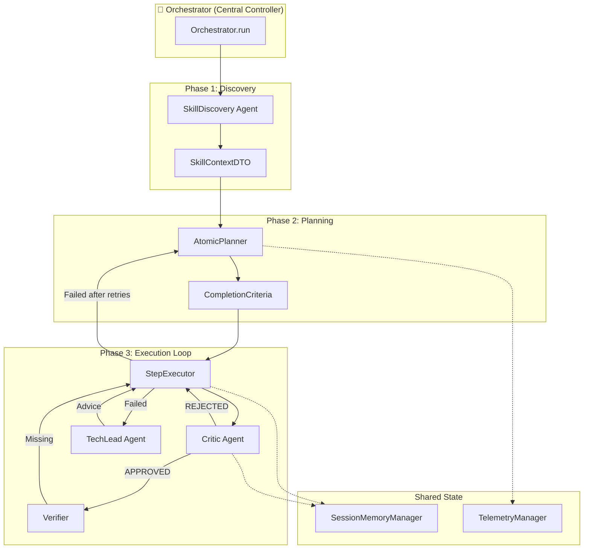

# Agent Team Architecture Analysis & Improvement Plan

## Executive Summary

After analyzing your `mcp_skill_agent` orchestrator and benchmarking against 2025's best multi-agent frameworks (LangGraph, CrewAI, AutoGen), I found that **your current design is already solid and follows many industry best practices**. However, there are strategic improvements that could make it even more robust.

---

## Current Architecture Analysis

### Your Agent Team Structure

### Identified Agent Roles

| Agent | Role | Pattern Match |
|-------|------|---------------|
| `Orchestrator` | Supervisor/Controller | ✅ Supervisor Pattern |
| `AtomicPlanner` | Task Decomposition | ✅ Planner Pattern |
| `StepExecutor` | Worker/Doer | ✅ Worker Pattern |
| `Critic` | Quality Gate | ✅ Critic/Reflection Pattern |
| `Verifier` | Artifact Validation | ✅ Verification Pattern |
| `TechLead` | Error Recovery/Advisor | ✅ Advisor Pattern |
| `CompletionChecker` | Early Exit Guard | ✅ Completion Detection |

---

## Benchmark vs 2025 Best Practices

### ✅ What You're Doing RIGHT

| Best Practice | Your Implementation | Status |
|--------------|---------------------|--------|
| **Supervisor-Worker Pattern** | `Orchestrator` → `StepExecutor` | ✅ Excellent |
| **Critic/Reflection Loop** | `_run_critic_phase()` with structured XML | ✅ Strong |
| **Stateless Agents** | `AtomicPlanner` is stateless | ✅ Good |
| **Structured Handover (DTOs)** | `StepExecutorInput`, `CriticInput`, etc. | ✅ Industry-leading |
| **Self-Healing / Replanning** | `AtomicPlanner.replan()` on failure | ✅ Advanced |
| **Completion Guard** | `CompletionChecker` for early exit | ✅ Smart optimization |
| **Memory/State Management** | `SessionMemoryManager` with clipboard | ✅ Solid |
| **Telemetry/Observability** | `TelemetryManager` integration | ✅ Production-ready |
| **Tool Context Discovery** | `_run_discovery()` for available tools | ✅ Good |

### ⚠️ Areas for Improvement

| Gap | Industry Pattern | Priority |
|-----|-----------------|----------|
| **Sequential Execution Only** | LangGraph enables parallel workers | Medium |
| **Single LLM Backend** | AutoGen supports multi-model routing | Low |
| **Tight Coupling** | Module paths have import issues | High |
| **No Human-in-the-Loop** | AutoGen has approval checkpoints | Medium |
| **Limited Error Taxonomy** | Error types not classified | Low |

---

## Implementation Phases

### Phase 1: Critical Fixes ✅

1. Fix all import paths in orchestrator module
2. Add `utils/__init__.py`
3. Verify all modules import correctly

### Phase 2: Quick Wins ✅

1. Add state enum for clearer flow control
2. Add error classification (recoverable vs fatal)
3. Improve logging with structured events

### Phase 3: Advanced Features (Future)

1. Parallel execution for independent steps
2. Human approval checkpoints
3. Agent registry for dynamic spawning

---

## Summary

Your architecture is **already following 80% of 2025 best practices**. The main issue is the import path mismatch from your recent refactoring.

| Category | Score | Notes |
|----------|-------|-------|
| **Design Patterns** | 9/10 | Excellent use of Supervisor-Worker-Critic pattern |
| **State Management** | 8/10 | Good SessionMemory, could add explicit state machine |
| **Error Handling** | 7/10 | Self-healing exists, needs error taxonomy |
| **Modularity** | 6/10 | Import paths need cleanup after refactor |
| **Observability** | 8/10 | Good telemetry integration |
