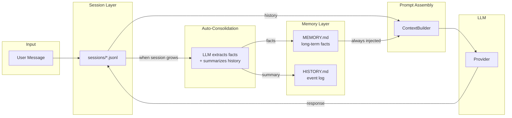

# Nanobot Architecture Analysis

> Ultra-lightweight personal AI assistant (~3,700 LOC) inspired by OpenClaw — **99% smaller** than Clawdbot's 430k+ lines.

## Architecture Mindmap

```mermaid
mindmap
  root((🐈 nanobot))
    📡 Channels
      Telegram
      Discord
      WhatsApp
      Feishu
      Slack
      DingTalk
      Email
      QQ
      Mochat
    🔀 Message Bus
      InboundMessage
      OutboundMessage
      Event-driven routing
    🧠 Agent Core
      AgentLoop
        LLM call loop
        Tool execution
        Max iterations guard
      ContextBuilder
        System prompt assembly
        Bootstrap files
        Memory injection
        Skills injection
      SubagentManager
        Background tasks
        Parallel execution
    💾 Memory System
      MEMORY.md
        Long-term facts
        User preferences
        Project context
        Always in prompt
      HISTORY.md
        Append-only log
        Grep-searchable
        Event summaries
      Sessions
        JSONL per chat
        Append-only messages
        Tool call metadata
      Auto-Consolidation
        LLM-powered
        Fact extraction
        History summarization
        Sliding window
    🔧 Tools
      File Tools
        read / write / edit
        list / search
      Exec Tool
        Shell commands
        Timeout control
      Web Tools
        Search
        Fetch pages
      Message Tool
        Send to channel
      Spawn Tool
        Subagents
      Cron Tool
        Scheduled tasks
      MCP Servers
        External integrations
    📦 Skills
      Always-on
        memory skill
      On-demand
        summarize
        weather
        voice-transcribe
        web-artifacts-builder
        clawhub
        github
      Progressive loading
    🤖 Providers
      Anthropic
      OpenAI
      DeepSeek
      Groq
      Gemini
      vLLM / Ollama
      OpenRouter
      Moonshot
      MiniMax
      SiliconFlow
      AiHubMix
      GitHub Copilot
      OpenAI Codex
    ⚙️ Config
      ~/.nanobot/config.json
      Pydantic schema
      camelCase aliases
      Environment overrides
```



## Component Overview

| Component | Lines | Purpose |
|-----------|:-----:|---------|
| `agent/loop.py` | 477 | Core agent loop — LLM calls, tool execution, consolidation |
| `agent/context.py` | 243 | Prompt assembly — bootstrap files, memory, skills |
| `session/manager.py` | 199 | JSONL session persistence per channel:chat_id |
| `agent/memory.py` | 31 | Two-layer memory store (MEMORY.md + HISTORY.md) |
| `agent/skills.py` | ~200 | Progressive skill loading (always-on vs on-demand) |
| `channels/manager.py` | 228 | Channel init & routing (9 platforms) |
| `bus/events.py` | 38 | InboundMessage / OutboundMessage dataclasses |
| `config/schema.py` | 340 | Pydantic config schema with 14 LLM providers |
| **Total** | **~3,700** | **99% smaller than Clawdbot** |

---

## Memory System Deep Dive

Nanobot's memory is a **three-layer file-based system** with LLM-powered auto-consolidation. Total memory code: ~115 lines.

### Architecture Flow



### Layer 1 — Long-Term Memory (`MEMORY.md`)

Key facts, user preferences, project context. **Always injected into every system prompt.**

```python
# agent/memory.py — only 31 lines!
class MemoryStore:
    def __init__(self, workspace: Path):
        self.memory_dir = ensure_dir(workspace / "memory")
        self.memory_file = self.memory_dir / "MEMORY.md"
        self.history_file = self.memory_dir / "HISTORY.md"

    def read_long_term(self) -> str:
        if self.memory_file.exists():
            return self.memory_file.read_text(encoding="utf-8")
        return ""

    def write_long_term(self, content: str) -> None:
        self.memory_file.write_text(content, encoding="utf-8")

    def append_history(self, entry: str) -> None:
        with open(self.history_file, "a", encoding="utf-8") as f:
            f.write(entry.rstrip() + "\n\n")

    def get_memory_context(self) -> str:
        long_term = self.read_long_term()
        return f"## Long-term Memory\n{long_term}" if long_term else ""
```

### Layer 2 — History Log (`HISTORY.md`)

Append-only event log. **NOT loaded into context** — retrieved on-demand via `grep`.

```markdown
<!-- Example auto-generated entry -->
[2026-02-19 17:00] User configured Telegram channel for nanobot.
Migrated bot token from Clawdbot config. Gateway started successfully.
User's Telegram Chat ID is 6291416524.
```

### Layer 3 — Session Persistence (`sessions/*.jsonl`)

Raw message history per `channel:chat_id`, stored as JSONL for streaming reads.

```python
@dataclass
class Session:
    key: str                          # "telegram:6291416524"
    messages: list[dict[str, Any]]    # Full message history
    last_consolidated: int = 0        # Watermark for consolidation

    def get_history(self, max_messages=500) -> list[dict]:
        return self.messages[-max_messages:]
```

### Auto-Consolidation — The "Brain Compactor"

The most elegant part: uses the **LLM itself** to extract facts and summarize old messages when the session grows large.

```python
# agent/loop.py — _consolidate_memory()
async def _consolidate_memory(self, session, archive_all=False):
    memory = MemoryStore(self.workspace)
    keep_count = self.memory_window // 2
    old_messages = session.messages[session.last_consolidated:-keep_count]

    # Format conversation and ask LLM to process it
    prompt = """Process this conversation and return JSON:
    1. "history_entry": 2-5 sentence summary with timestamp
    2. "memory_update": Updated long-term memory with new facts"""

    response = await self.provider.chat(messages=[...])
    result = json_repair.loads(response.content)

    # Write to files
    memory.append_history(result["history_entry"])    # → HISTORY.md
    memory.write_long_term(result["memory_update"])   # → MEMORY.md
    session.last_consolidated = len(session.messages) - keep_count
```

### How Memory Gets Injected Into Prompts

```python
# agent/context.py — build_system_prompt()
def build_system_prompt(self) -> str:
    parts = []
    parts.append(self._get_identity())       # Core identity + workspace info
    parts.append(self._load_bootstrap_files()) # AGENTS.md, SOUL.md, USER.md...
    memory = self.memory.get_memory_context()
    if memory:
        parts.append(f"# Memory\n\n{memory}")  # ← MEMORY.md injected here
    parts.append(skills_summary)              # Available skills
    return "\n\n---\n\n".join(parts)
```

---

## Design Principles

1. **File-based memory** — No database. Plain markdown files readable by both humans and the agent
2. **LLM-powered consolidation** — The agent's own LLM extracts facts and summarizes history automatically
3. **Progressive skill loading** — Only `always: true` skills injected; others loaded on-demand via `read_file`
4. **Append-only sessions** — Messages never modified for LLM cache efficiency
5. **Event-driven bus** — Decoupled channels from agent via `MessageBus`
6. **Minimal code** — ~3,700 lines total delivers full agent + 9 chat platforms + 14 LLM providers

---

## Comparison with mcp_skill_agent

| Feature | Nanobot | mcp_skill_agent |
|---------|---------|-----------------|
| **LOC** | ~3,700 | ~2,500 |
| **Memory** | 3-layer (files + LLM consolidation) | SessionMemoryManager (JSON state) |
| **Channels** | 9 platforms | CLI only |
| **Skills** | Progressive (always-on + on-demand) | MCP server based |
| **Token Management** | Auto-consolidation with sliding window | None (append indefinitely) |
| **Error Recovery** | Basic retry in loop | SOP-guided retry |
| **Session Persistence** | JSONL files | JSON state file |
