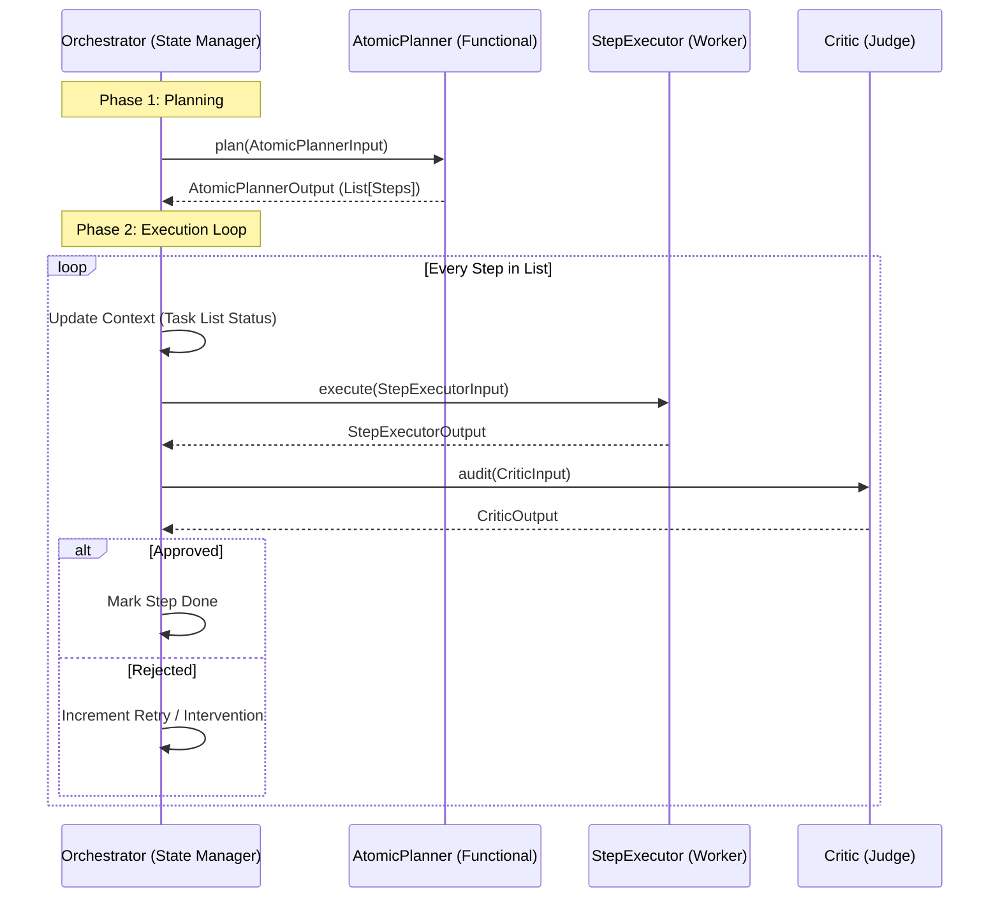

# AtomicPlanner Architecture: Stateless Refactor Analysis

This report analyzes the architectural shift of the `AtomicPlanner` from a **Stateful Agent** to a **Stateless Pure Function**. This change aligns with the "Industrial Orchestrator" pattern where the Orchestrator manages all lifecycle and state, while specialized agents (Planner, TechLead, Critic) act as functional services.

## 1. Architectural Comparison

### Previous: Stateful Planner (Legacy)

The Planner maintained its own internal pointer (`current_index`) and list of steps. The Orchestrator had to ask the Planner "What is next?" and "Are you done?".

**Flow:**

1. Orchestrator calls `sop.initialize()`.
2. Loop `while not sop.is_finished()`:
3. Orchestrator asks `sop.get_current_step()`.
4. Orchestrator executes step.
5. Orchestrator calls `sop.mark_step_done()`.

**Drawbacks:**

- **Hidden State**: Debugging requires inspecting the Planner's internal state.
- **Rigidity**: Hard to inject dynamic steps or re-order the plan mid-flight without complex Planner methods.
- **Testing**: Requires instantiating a stateful object and mocking its transitions.

---

### New: Stateless Planner (Function-as-a-Service)

The Planner accepts a context (`AtomicPlannerInput`) and returns a complete execution plan (`AtomicPlannerOutput`). It forgets everything immediately after returning. The Orchestrator "owns" the plan and iterates through it.

**Flow:**

## 2. Pros & Cons Analysis

| Feature | Stateless Planner (New) | Stateful Planner (Old) |
| :--- | :--- | :--- |
| **State Management** | **Centralized (Orchestrator)**. Single source of truth. | Distributed. Orchestrator and Planner both hold partial state. |
| **Testability** | **High**. Easy to unit test `plan()` with fixed inputs/outputs. | Medium. Tests depend on internal state transitions. |
| **Re-planning** | **Flexible**. Orchestrator can discard the old list and call `plan()` again with new context (e.g., error logs). | Difficult. Planner needs specific "update/edit" methods to mutate its internal list. |
| **Simplicity** | **High**. Planner is just a transformation function: `Context -> Plan`. | Lower. Planner is an object with lifecycle methods. |
| **Complexity** | **Shifted to Orchestrator**. Orchestrator loop code is slightly more verbose (manually iterating). | Encapsulated. Orchestrator loop was cleaner (`while not done`), but obscured logic. |

## 3. Production-Grade Suggestions

Moving to a stateless architecture opens up several advanced capabilities:

### A. Dynamic Re-Planning (Self-Healing)

If execution fails repeatedly, the Orchestrator can trigger a "Re-Plan" event.

- **Mechanism**:
    1. Orchestrator pauses execution loop.
    2. Collects `completed_steps` and `failed_step_error`.
    3. Calls `AtomicPlanner.replanning_mode(current_plan, error_context)`.
    4. Planner returns a **new** list of remaining steps (e.g., inserting a "Fix Dependencies" step).
    5. Orchestrator replaces the tail of its current generic list.

### B. Plan Caching

Since `plan()` is a pure function (Input -> Output), its results can be cached.

- **Use Case**: Common requests ("Install React App") always yield the same plan skeleton.
- **Impl**: Add a Redis/In-Memory cache layer decorators around `AtomicPlanner.plan`.

### C. A/B Testing Prompts

Easier to swap out the Planner's internal logic (e.g., `AtomicPlannerV2` vs `AtomicPlannerV1`) without changing the Orchestrator's loop code, as long as they both satisfy the `AtomicPlannerOutput` contract.

### D. Parallel Execution

The Orchestrator explicitly holds the list of steps. It can analyze the dependency graph (if we add `dependencies` to `SkillStep` DTO) and execute non-dependent steps in parallel using `asyncio.gather`. This was nearly impossible when the Planner controlled the "next step" cursor.

## 4. Recommended Next Steps

1. **Strict DTO enforcement**: We have already done this (`AtomicPlannerInput/Output`).
2. **Telemetry**: Log the full `AtomicPlannerOutput` as a JSON blob in traces for simplified debugging.
3. **Error Handling**: Enhance `AtomicPlanner` to return a `reasoning` field in its Output DTO, explaining *why* it chose those steps (helpful for Critic).

## Conclusion

Refactoring to a stateless flow significantly increases the robustness of the system. It decouples **Decision Making** (Planner) from **Execution Management** (Orchestrator), allowing the Orchestrator to become a simpler, more observable state machine.
