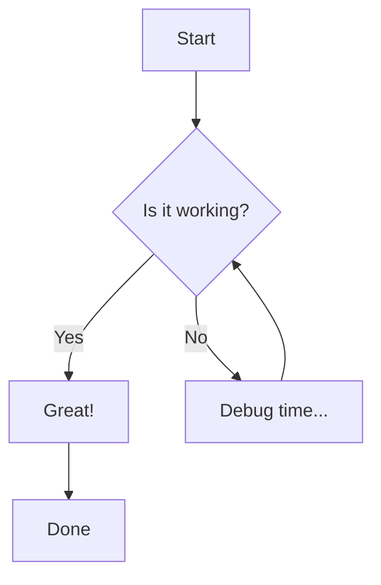
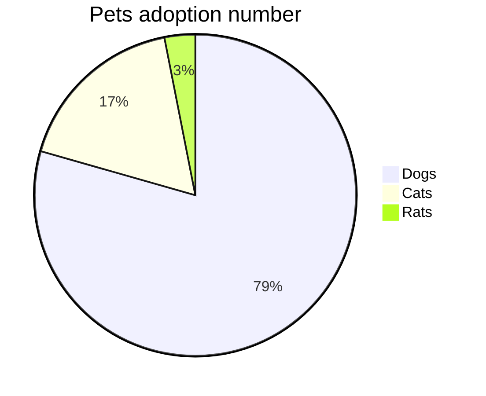

# Testing Markdown Enhancements

This post verifies that GFM tables and Mermaid diagrams are rendering correctly.

## GFM Table

| Feature | Support | Status |
| :--- | :--- | :--- |
| Tables | Yes | ✅ Working |
| Mermaid Diagrams | Yes | ✅ Working |
| Code Syntax | Yes | ✅ Existing |

## Mermaid Diagram

Another one:

